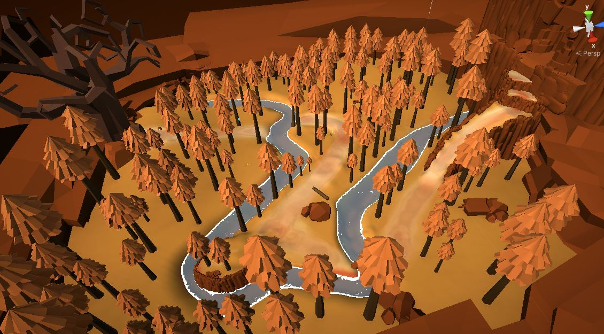
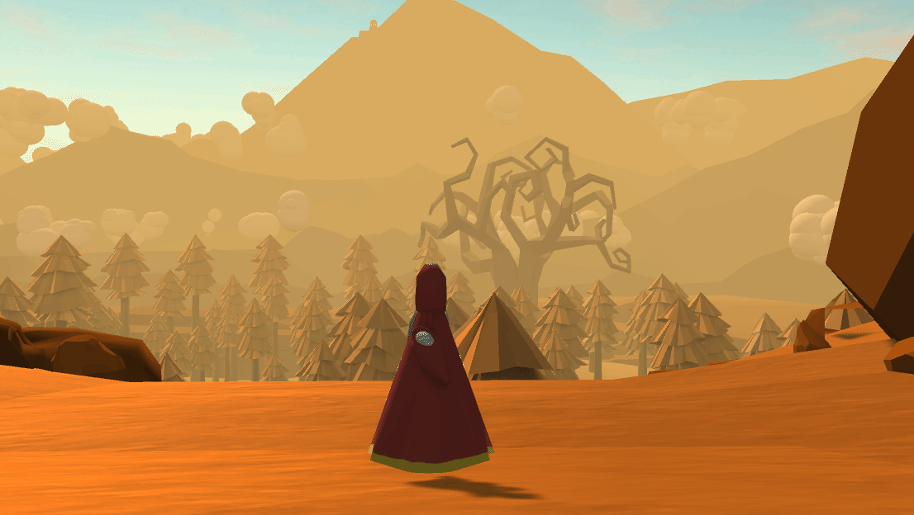

# Group 2's Game: Mother

<p align="center">
   
</p>

## [Watch the Trailer HERE](https://www.youtube.com/watch?v=lMBrq4AbAS0)

## Table of contents

- [Team Members](#team-members)
- [Technologies](#technologies)
- [Explanation of the game](#explanation-of-the-game)
- [Synopsis](#synopsis)
- [How to use the game](#how-to-use-the-game)
- [Game object and entities](#game-object-and-entities)
- [Camera motion and controls](#camera-motion-and-controls)
- [Graphics pipeline](#graphics-pipeline)
- [Procedural Generation](#procedural-generation)
- [Shaders](#shaders)
- [Particle Systems](#particle-systems)
- [Evaluation](#evaluation)
- [Previous camera and controls](#previous-camera-and-controls)
- [References](#references)

## Team Members

| Name           |                                                  Task                                                  | State |
| :------------- | :----------------------------------------------------------------------------------------------------: | ----: |
| Benjamin Evans |       Character design, Art, Sound, Video, Triggers, Particles, Evaluation, Level design, README       |  Done |
| Raymond Li     |  3rd person camera, Game controls, Movement, Particles, Fog shader, Evaluation, Level design, README   |  Done |
| Risa Pais      | Camera zones, Terrain, Procedural generation, Respawns, Water shader, Evaluation, Level design, README |  Done |

## Technologies

Project is created with:

- Unity 2021.1.13f1

## Explanation of the game

<p align = "center" ><i>I remember now what my mother gave</br>
  She carried me, crying, from her cave</br>
Through Forest yellow and cavern wide</br>
She carried me up the mountainside</br>
She walked the path that mothers do</br>
Now is my time to walk it too</br>
I have seen the future and the past</br>
She was not the first,</br>
  I am not the last...</i></p>

When first deciding on the concept for this game, we consulted folk tales for ideas. We were drawn to the repeating tale of the mother, who will go to the ends of the earth for their child. This tale is present in many cultures and translated well into a concept for our game.

Mother is an adventure/art game, reflecting the journey of motherhood and its beautiful, cyclical nature. Mothers carry children into this world, through thick and thin, and eventually, children become mothers (or parents) themselves.

<p align = "center"><i>Every mother has a mother</br>
  Soon enough will come another...</br></i></p>

## Synopsis

We took inspiration from games such as Journey, Sky: Children of the Light, Omno, Gris, and Abzu. These games were calm, relaxing, non-violent, and had iconic visual styles.

In Mother, you play as a mother carrying her child to the top of a mountain, as a metaphor for childbirth. The mother passes through the starting cave into a forest, then inside the mountain, and then finally up to a temple on the mountainside.

The game starts with a poem and wall paintings that hint at this story of the mother being passed down each generation. The wall paintings that depict the mother's journey already exist before the game has even begun, suggesting that many other mothers have already completed the journey before. We also aimed to give a sense of monolithic ancient structures in our level design, using large columns, archways, old trees and the temple. We tried to show the cyclical nature of motherhood in the way that the game transitions from the final scene to the first scene again, all to (hopefully subtly) illustrate the idea that every mother had a mother themselves. The story of our game tries to briefly touch on themes of motherhood and the passage of time.

## How to use the game

If opening the game via the Unity development enviroment, navigate to Assets -> Scenes -> Mother_0_tutorial_cave to access the first scene to start the game.

<p align="center">
   
</p>

The main menu is displayed upon starting the game. Players can begin playing the game by clicking start and alternatively quit the application by clicking quit. Players can press the 'Esc key to access the main menu anytime during the game. In addition, the player's cursor will be locked and hidden during gameplay, this can be toggled on and off via the 'alt' key ('option' key for Mac users). The number keys '1,2,3,4' can be used during the game to quickly skip to the corresponding game level/scene.

## Game object and entities

<p align="center">
  
</p>

As previously mentioned, some key sources of inspiration for Mother have been Journey, and Sky: Children of the light. These games are renowned for their fantastic visual impact, and many visual elements of Mother have taken inspiration from them.

We used a Miro Board to collaborate on the design aspects of each level which allowed us to also source assets collectively and agree on themes ahead of actually creating those levels in unity. To view the board, click <a href = "https://miro.com/app/board/o9J_lx_IDoI=/?invite_link_id=64658128800">here</a>

**Character Model**

<p align="center">
  
  
</p>

The character model of the Mother takes inspiration from the cloaked figure of the character in Journey. The red cloak and mask allowed the Mother an aura of mystery which gave us greater creative range with the remainder of the game - she doesn't resemble a human and so it was natural that the game did not have to conform to reality.

**Mountain**

<p align="center">
  
  
</p>

We took inspiration for the mountain background of the forest scene from Sky: Children of the Light. By having a far away destination visible from the start of the game, the player is more able to visualise where the character is trying to go.

**Tutorial**

For the tutorial scene, we wanted everything to be quite dark so that the emissive wall paintings would catch the players attention. These wall paintings reflect much of what happens in the game and were originally used as the sole method of communicating the story of the game (we added different methods after receiving player feedback).

<p align="center">
  
</p>

The darkness of the tutorial scene also allows the transition to the brighter forest scene to have a greater impact through contrast.

**Forest**

Because of the subdued nature of the colors from other parts of the game, we decided to make the forest more of an orange tone in place of green hues. This complemented the player's cloak well, and provided visual consistency with the rest of the game. To keep the forest from appearing 'dead' the river was coloured with blue, and this large mass of blue also allows a rest for players' eyes. The trees were kept tall and almost identical to add to the surreal and vast feel of the forest, especially in comparison to the mother.

<p align="center">
  
</p>

**Cavern**

In the mountain cavern, despite it being another 'cave' of sorts, we didn't want to mimic the visual design of the tutorial. Again, we opted for a relatively vast setting, and the red jellyfish helped to ensure the colour palette wasn't completely atonal whilst providing light.

<p align="center">
  
</p>

**Final Scene**

For the final setting (the mountain top) we wanted to show a temple: to represent that the cycle of motherhood is ancient and that the Mother's journey is not the first or last. Temple assets from the unity store were used, and the fog shader was also used for dramatic effect. The final statue is inspired by Native American artwork and is used in the game logo for visual consistency.

<p align="center">
  
</p>

## Camera motion and controls

Note: This systems is implemented as part of an improvement update (after evaluation), check out the previous camera and controls: [here.](#previous-camera-and-controls)

<p align="center">
  
</p>

The game uses a fixed 3rd person camera. The camera and the character will rotate together, and the controls via "WASD" will always be relative to the camera. The in-sync rotation relative to the character allows for good immersion similar to that of a first-person camera; which coupled with a third-person view allows for a better perception of the player's surroundings.

#### The third person camera motion

The game camera's rotation is controlled by the mouse. Upon colliding with the game environment, the camera will zoom in towards the player character to avoid the camera from clipping through the object. This is achieved by setting up a parent object for the camera to indicate the location for which the camera should move towards when there is a collision. 'SphereCast' is then used to detect collisions and the camera's position is transformed accordingly.

In addition, the cursor is hidden and locked to the centre of the screen to allow for infinite camera rotation controls.

The code is as follows:

```c#
void LateUpdate()
    {
        if (Input.GetKeyDown(KeyCode.LeftAlt))
        {
            if(lockSwitch){
                UnlockCursor();
                lockSwitch = false;
            }
            else {
                LockCursor();
                lockSwitch = true;
            }
        }

        Vector3 currentPos = defaultPos;
        RaycastHit hit;
        Vector3 dirTmp = parentTransform.TransformPoint(defaultPos) - referenceTransform.position;
        if (Physics.SphereCast(referenceTransform.position, collisionOffset, dirTmp, out hit, defaultDistance, ~(1<<layerMask)))
        {
            currentPos = (directionNormalized * (hit.distance - collisionOffset));
            transform.localPosition = currentPos;
        }
        else
        {
            transform.localPosition = Vector3.Lerp(transform.localPosition, currentPos, Time.deltaTime * camSpeed);
        }
    }
```

#### Other game mechanics

Advanced controls and movement are also included in the game to improve the player experience. These include jump, double jump, glide, sprint and slide, all of which are explained to the player at the tutorial stage (level 1) of the game.

<p align="center">
  
</p>

Trigger-based interactions via key presses are used in the game where players can manually interact with certain objects in the environment. Interaction mechanics range from simple door triggers to puzzles; increasing in complexity as the game progresses. Automatic events are also implemented in the game and these are activated by trigger zones that the players can walk into. The triggers all use the Unity Event system to allow for flexible and extensible use.

<p align="center">
  
</p>

## Graphics pipeline

The game uses Unity's Universal Render Pipeline (URP). We chose URP for its improved point lighting and easy post-processing. Visual style and consistency was a focal point of ours, and URP's adjustments and bloom effects were important for the look of the game and also for improving visibility in dark scenes. We applied contrast and a gamma boost in the tutorial scene to increase visibility. A bloom helped emissive materials glow, which we used to guide players towards important interactions and exits. Most of our materials only used the default URP lit shaders for their performance and ease of use. Visible game objects are rendered through the GPU using both the built in Unity shaders and the custom shaders described [here](#shaders). These shaders modify both the vertex and pixel shader stages of the pipeline. The forward rendering path was used for this project as there was no complex lighting which would benefit from a deferred rendering path, however there were semi-transparent objects (such as the water shaded by the water shader) which would require additional forward rendering passes to be displayed correctly had we used a deferred rendering path.

## Procedural generation

### Clouds

The directory for the procedural generation are located in: Assets -> Scripts -> Global -> Clouds

<p align="center">
  
</p>

Perlin Noise was used to generate a cloud skyscape in level 1 (forest) of the game.

The idea of self similarity was used to build the clouds. Each cloud is made of a number of spheres whose radius is smoothly increasing and decreasing to a random value within a specified range, at a specified speed:

<p align="center">
  
</p>

Each sphere is controlled by the MorphSphere script whose update method allows the sphere to morph this way:

```c#
void Update()
    {
        float distCovered = (Time.time - time)*speed;
        float fractionOfJourney = distCovered/length; //length is the distance from the original scale vector to the target scale vector
        transform.localScale = Vector3.Lerp(startScale, newScale,fractionOfJourney );
        if (transform.localScale == newScale){
            Reset();
        }
    }
```

A cloud object is generated by the Cloud Generator component, whose Generate Cloud Method can take in a starting point and generate a cloud that contains a random number of spheres (within a specified range) and of a random scale (again, within a range). This is to give some control over the Density and size of each cloud. Each sphere is equidistant from the last, and appended to the last in a random direction out of the 6 basic directional vectors (forward, back, up, down, left and right).

Three example clouds generated with the same input parameters

<p align="center">
  
  
  
</p>

The Generate Cloud Method, and Create Cloud helper are as below:

```c#
    public void GenerateCloud(Vector3 start){
        int numSpheres = (int)Random.Range(minSize,maxSize);
        float scalefactor = Random.Range(minScale,maxScale);
        GameObject cloud = CreateCloud(start, scalefactor);

        GameObject lastSphere;
        lastSphere = Instantiate(cloudMesh, cloud.transform.position, cloud.transform.rotation, cloud.transform);
        for (int i = 0; i < numSpheres; i++){
            int direction = (int)Random.Range(0,directions.Length-1); //directions is a member of the Cloud Generator object - it is a list of directional vectors
            lastSphere = Instantiate(cloudMesh, lastSphere.transform.position+(scalefactor/2*directions[direction]), cloud.transform.rotation, cloud.transform);
        }
        return;
    }

    private GameObject CreateCloud(Vector3 start, float scaleFactor){
        GameObject cloud = new GameObject("cloud");
        cloud.transform.localScale = new Vector3(scaleFactor, scaleFactor, scaleFactor);
        cloud.transform.parent = transform;
        cloud.transform.position = start;
        cloud.transform.rotation = Quaternion.identity;
        return cloud;
    }
```

Finally, the Sky Controller actually creates a landscape of clouds using Perlin noise. From observation, clouds are rarely small and spread out, but tend to clump together leaving patches of the open sky. As such it made sense to populate the defined 'Cloudscape' using a cutoff value generated through a Perlin noise map, where pseudorandomness and self-similarity are present.
An area over which clouds are to spawn is specified in the editor (imagine a cube-like shape). At each x and z value (in world space), the color at the corresponding Perlin Coordinates are checked, and if it is over the specified cutoff value, a random cloud is generated at those coordinates, with the y value randomised within a range specified in the editor. The Perlin Noise Script Randomises an offset each time the game is started, so the points at which the clouds generate will be different each time. Finally, since the scale and number of spheres vary cloud to cloud, to prevent clouds from forming one on top of the other, a skip value is specifiable, and the algorithm will only check the Perlin color on the nth xy value (for example, if the CloudScape is 100x100, and we specify skip value of 10, the algorithm will only check the color 10x10 times. The CloudScape is populated in the Start method like so:

```c#
   void Start()
    {
        for(int i = 0; i < xRange*2; i ++){
            if (i%skip != 0){
                continue;
            }
            for(int j = 0; j < zRange*2; j++){
                if(j%skip == 0){
                    if (GetComponent<PerlinNoise>().CalculateColor(i,j).r >= cutOff){
                        float yOffset = Random.Range(-yRange, yRange);
                        GetComponent<CloudGenerator>().GenerateCloud((new Vector3(start.position.x + (float)i-xRange, transform.position.y + yOffset, start.position.z + (float)j-zRange)));
                    }
                }
            }
        }
    }
```

## Particle systems

We made several particles systems, including leaves, fog, and fireflies. The player movement particles are the most prominent, however. This dust effect consists of two parts: smaller particles emitted when the player moves, and larger particles emitted when the player lands on the ground after jumping or falling.

We use a raycast to sample the albedo colour of the object below the player and apply that colour to the particles so that they suit the player's environment. The system emits smaller particles in the opposite direction to the player's movement to give the impression of dust being kicked up by the player. We apply noise to the particles' velocity to give the sense of dust being carried by the wind. The larger particles use a spiral sprite that mimics the spirals in the wall paintings and have additional upwards velocity. This upwards velocity helps to give more of an impact to the player landing and improve the feel of the player controls.

<p align="center">
  
  </br>
  <i>Difference in Brightness - Before and After</i>
</p>

## Shaders

The directory for the custom shaders are located in: Assests -> Visuals -> Shaders

### #1: The fog shader

<p align="center">
  
</p>

The custom fog shader (on the far right) is created as a combination of two separate shader effects.

The first component of this shader is a static verticle fog shader as displayed in the middle of the three. This shader takes in a solid color and utilises the transparent object effects. The fragment shader component first gets the linear eye depth of the pixel and then works out the difference of that depth as compared to the depth of its screen space coordinate. Finally, the color is interpolated linearly across the object based on the difference, assigning color to it from the solid color to completely clear.

Here is what it looks like in code:

```c#
half4 frag(v2f i) : SV_TARGET
{
    float depth = LinearEyeDepth (tex2Dproj(_CameraDepthTexture, UNITY_PROJ_COORD(i.scrPos)));
    float diff = saturate(_IntersectionThreshold * (depth - i.scrPos.w));
    fixed4 col = lerp(fixed4(_Color.rgb, 0.0), _Color, diff);

    UNITY_APPLY_FOG(i.fogCoord, col);
}
```

A dynamic noise map is then added to the vertical fog effect. Certain pixels from the verticle fog are cleared based on the noise map and the texture is shifted across the surface to create movement.

Here is what it looks like in code:

```c#
half4 frag(v2f i) : SV_TARGET
{
    ...

    float speed = _Time.y * float2(_FogSpeedX, _FogSpeedY);
    float noise = (tex2D(_NoiseTex, i.uv + speed).r - 0.5) * _NoiseLevel;
    return col * (1 - noise);
}
```

And here is the fog shader in action:

<p align="center">
  
</p>

### #2: The water shader

The custom water shader in this game combines a number of techniques to achieve the desired visual effect.

<p align="center">
  
</p>

**Depth Gradient**

_Camera Depth Texture_

Each vertex’s texture coordinates for screenspace-mapped texturing are computed in the vertex shader, and then passed into the fragment shader and used to sample the \_CameraDepthTexture property. This texture contains values between 0 and 1 representing the distance of objects from the camera (stored as grayscale color – we have taken the red value but blue or green could also be used). As the sample values are non-linear, they are then converted into a linear depth in world units from Camera to opaque object beneath the water’s surface (and not the water itself since the water is marked as transparent for the render Queue). This can be done using the LinearEyeDepth function.

Then, to get the depth of the object, relative to the surface of the water, simply subtract the w coordinate of the screen position coordinate passed in from the vertex shader (which corresponds to world space view depth) from the linear depth calculated. A camera depth value specifying the maximum depth (underneath the surface of the water) can be specified in the inspector. This is used to calculate a % of the maximum depth for each instance (clamped between 1 and 0), which is then passed into the Lerp function to calculate a color value for the water itself – which is a gradient between the colors selected for deep and shallow water in the inspector. As such, increasing the ‘Maximum depth difference’ reduces the portion of shallow water and vice versa.

<p align="center">
  
</p>

**Foam & Surface Distortion**

_Animated Perlin Noise_

A Perlin Noise Texture is used and animated across the surface of the water to create a wave effect. In order to reduce the number of waves, a cutoff value for how ‘white’ the sampled portion of the texture is has been applied (this can be set in the editor). If the ‘whiteness’ is above the threshold value, white foam is displayed.

_Shoreline Noise_

To make foam collect on the edges of the shore are around objects in the water, the previously calculated depth (relative to the water) is divided (and clamped) by a new \_FoamDistance property, which is then multiplied by the threshold value to create a new threshold value – hence, the threshold for displaying white foam will be lower when the water’s relative depth is lower resulting in more foam displayed.

<p align="center">
  
</p>

_Distortion Mapping_

To distort the foam further, resulting in a more natural/ripple effect, a distortion map texture was used. This is a texture with only red and green values. Those values are multiplied by two and have 1 subtracted to fit in the (-1,1) range so that they can be used to offset the x and y values of the noise as it travelled across the water. They are also multiplied by the \_Distortion Amount property to allow for modifying the level of distortion. The distortion values are applied to the time factors which were previously used to animate the Perlin noise.

<p align="center">
  
</p>

_Anti-Aliasing_

In order to reduce some of the jagged edges of the foam, the smoothstep function is used. This takes in a small range surrounding the surface noise cutoff value, and if the sampled noise is within that range, it will smooth the surface noise colour to be slightly closer to the colour of the water.

<p align="center">
  
  </br>
  <i>Before and After Anti-Aliasing</i>
</p>

**Pseudo Reflection, Refraction/Transparency and Movement**

_Camera Opaque Texture_

The Camera Opaque Texture holds the render of all opaque images in the scene before transparent objects are rendered. This was used rather than the blend modes available as it allowed for the image beyond the surface to be distorted in a way that simulates refraction/reflection (this is not intended to be realistic, it is simply a visual effect to enhance the impact of the water shader).

To do this, in the vertex shader, the x and y coordinate of the input vertex is displaced using sin functions before being converted to screen space and passed to the fragment shader. There the offset vertex’s screen position is used to sample the Camera Opaque Texture and thus produces a wavy effect which gives the water some movement, and some reflections for items close to the water’s edge. This of course isn’t a true reflection, as the images that are seen in the water are facing the same way as they are through the camera – however it is still an effective tool for enhancing the visuals of the game. Note, the vertex has to be offset in the vertex shader, before it is converted to screen space, otherwise the water can show reflections for objects which are next to each other on the screen, even though they are quite far away in world space.

_Vertex Displacement_

Finally, a cosine wave is used to increase and decrease the water level with time, similar to a tide coming in and out.

<p align="center">
  
</p>

The final vertex shader looks like this:

```c#
vertOut vert (vertIn i)
            {
                vertOut o;
                //displace y value of vertices for tide effect
                float wave = cos(i.uv.y - _Time.y*2)*5;
                i.vertex.y = wave*_WaveAmp;

                //vertex to clip space
                o.vertex = UnityObjectToClipPos(i.vertex);

                //texture coordinates forcamera depth texture mapping
                o.screenPosition1 = ComputeScreenPos(o.vertex);

                //displace and calculate screen texture coordinates for camera opaque texture mapping
                float4 refractionVertex = o.vertex;
                float refractionWave1 = sin(i.vertex- _Time.y*_RefractionSpeed)*5;//multiplied by 5 for effect to be visible
                float refractionWave2 = sin(i.vertex- _Time.y*_RefractionSpeed)*5;
                float refractionWave3 = sin(i.vertex - _Time.y*_RefractionSpeed)*5;
                refractionVertex.x = refractionVertex.x + refractionWave1*_RefractionStrength;
                refractionVertex.z = refractionVertex.z + refractionWave2*_RefractionStrength;
                refractionVertex.y = refractionVertex.y + refractionWave3*_RefractionStrength;
                o.screenPosition2 = ComputeGrabScreenPos(refractionVertex)/refractionVertex.w;

                //get texture mapping coordincates for noice and distortion maps
                o.noiseUV = TRANSFORM_TEX(i.uv, _SurfaceNoise);
                o.distortionUV = TRANSFORM_TEX(i.uv, _NoiseDistortion);

                return o;
            }
```

And the fragment shader:

```c#
float4 frag (vertOut i) : SV_Target
            {
                //DEPTH GRADIENT EFFECT
                //Sample the depth texture for depth gradient effect
                float4 existingDepth = tex2Dproj(_CameraDepthTexture, UNITY_PROJ_COORD(i.screenPosition1));
                float existingDepthLinear = LinearEyeDepth(existingDepth).r;
                //Get depth of objects underwater relative to surface level
                float depthDiff = existingDepthLinear - i.screenPosition1.w;
                //get relative depth as % of max depth (clamped) and use to calculate water color
                float waterDepthDifference = saturate(depthDiff/_DepthMaxDistance);
                float4 waterColor = lerp(_DepthGradientShallow, _DepthGradientDeep, waterDepthDifference);

                //TRANSPARENCY/UNDERWATER DISTORTION
                 //Sample the opaque texture for transparency/reflective effect
                float4 refracted = tex2Dproj(_CameraOpaqueTexture, i.screenPosition2);
                //Reduce water value alpha per _Refraction amount in inspector
                waterColor.a = 1 - _Refraction;
                //Blend water and underwater colors
                float4 riverColor = alphaBlend(waterColor, refracted);

                //FOAM AND SURFACE DISTORTION ANIMATION
                //Sample distortion map texture, transform to val between -1 and 1, and scale effect based on _DistortionAmount
                float2 distortionSample = _DistortionAmount * ((tex2D(_NoiseDistortion,i.distortionUV).xy)*2-1);
                //Animate perlin noise with respect to time and _NoiseMovement, adding distortion
                float2 noiseUV = float2((i.noiseUV.x + _Time.y * _NoiseMovement.x) + distortionSample.x, (i.noiseUV.y + _Time.y * _NoiseMovement.y)+ distortionSample.y);
                //Sample perlin noise texture
                float surfaceNoiseSample = tex2D(_SurfaceNoise, noiseUV).r;
                //Lower foam cutoff for shallower regions/partially submerged objects
                float foamDepthDiff = saturate(depthDiff / _FoamDistance);
                float surfaceNoiseCutOff = foamDepthDiff*_SurfaceNoiseCutOff;
                // Get surfaceNoiseColor using Antialiasing Macro
                float surfaceNoise = smoothstep(surfaceNoiseCutOff - SMOOTHSTEP_AA, surfaceNoiseCutOff + SMOOTHSTEP_AA, surfaceNoiseSample);

                //FINAL COLOR
                return riverColor+surfaceNoise;
            }
```

## Evaluation

### Methodology

Due to the time-sensitive nature of the project, it was important to begin evaluation before the game was completed. To allow more opportunity for iteration, evaluation was conducted in 2 equal-sized batches with a chance to implement changes in between. The focus of the testing was in the tutorial section to level 1 (forest) of the game, as this is where the story and game controls are introduced. As Mother has a narrative to it, and since the player embarks on a journey rather than through a series of very similar levels, it was more important to collect qualitative, rather than quantitative, data, and so much of the feedback received was subjective. However, commonalities in the data were identified to distinguish between necessary changes and player preferences.

The age bracket of participants was between late teens and early twenties as these were the age groups deemed most likely to play the game. This was also the most easily accessible age group for testing purposes. Within this range, a diverse range of participants was used. The demographic information for our testers is displayed below:

<p align="center">
  
</p>

A tester role was set up in our group Discord Server, and each participant was allowed access to the testing voice and text channels. The game build for testing was shared via a google drive link and each participant was given permission to access the drive at the time of interview (to ensure it was truly their first time playing). Notes for both interviews and observation sessions were recorded by the group member conducting the evaluation and shared immediately in the notes thread of the Discord Server for all other members to access.

**Observation Method**

We used the think-aloud observation technique. Players were prompted with questions whilst playing the game and screen sharing on discord, and their responses and interactions with the game were observed and recorded. Notes were taken by one group member and shared with the group directly after each observation session.

**Querying Technique**

A semi-structured interview style was chosen as the querying technique, as this allowed for us to probe further in trying to understand each participant's responses, but ensured that all parts of the game still received some feedback from the participant. The following questions were used as starting points to broader discussions with interviewees:

1. What did you think of the story?
2. What was one thing you liked, and one thing you disliked about the game?
3. What were the most and least visually appealing parts of the game?
4. What was the most exciting part of the game?
5. What was the most frustrating part of the game?
6. Which parts were too easy, and which parts were too difficult?
7. Did you encounter any performance issues whilst playing (i.e. lag/jitter)
8. What are your thoughts on the camera system and controls of the game?
9. Did you get stuck at any point in the game?

Again, notes were taken by one group member and shared imediately after each interview.

### Issues & Changes

**Player Movement & Cameras**

It was found in the first round of observation that the controls were an issue for several participants, even if they didn't identify this themselves. For example, moving the Mother character out of a room took several attempts, and players frequently walked her into walls. This issue seemed to arise from the player's movement being aligned to its local axis, and hence independent of the current camera position. As such this was also an issue for the camera system, which originally had consisted of mainly static cameras, whose rotation changed depending on the character's location. This made it more difficult to gauge the direction players were supposed to travel in, which was evidenced by the significant drop in respawns/player collisions in the zones where the camera followed the player. After observations, significant changes were made to the camera and player controls to account for this (see [Camera motion and controls](#camera-motion-and-controls) as compared to [Previous camera and controls](#previous-camera-and-controls)).

<p align="center">
  </br>
  <i>Previous Camera Example</i>
</p>

**Camera clipping**

It was noted during observations that players who were new to the game were far more explorative than expected, hence the camera (when following the player) ended up in many difficult positions, obscuring the player from view or otherwise disrupting the flow of the game. As part of the new camera system mentioned above, collision detection and adjustment were applied to the camera.

**Tutorial Brightness**

Most participants in the first round of observations noted that the tutorial scene was too dark and that they were finding it difficult to see which impacted their experience of the game. This was rectified quite easily by increasing the amount of light in the scene.

<p align="center">
  
  </br>
  <i>Difference in Brightness - Before and After</i>
</p>

**Interaction Feedback**

Players noted that in the cavern prior to the forest scene, it was hard to tell that the door to the outside had opened after interacting with the handprint rock, and many of them kept trying to interact with the rock after the door had opened without realising. As such the decision was made to move the button closer to the door so that impact of opening the door was immediately evident.

<p align="center">
  
  </br>
  <i>Posotion of Hand - Before </i>
</p>

<p align="center">
  </br>
  <i>Position of Hand - After</i>
</p>

**Cavern Puzzle**

Originally in level 2, there was a particular order that the buttons had to be pressed to be able to reach the stairs to the final scene. This puzzle involved revisiting previous buttons to figure out the exact configuration which would allow a path to the end. However, when playing the game, it was clear that many players, particularly those less experienced, struggled with the mechanics of jumping, and found it difficult to understand where the character was supposed to go. This was clear both through observation, and when interviewed about the 'most difficult part of the game. To account for this, a more linear path was designed allowing players to progress easily through the level.

<p align="center">
  
  </br>
  <i>Before (Left) and After (Right) - Cavern Puzzle</i>
</p>

**Game Objective**

To communicate the meaning, story and intention of the game, we had originally put in wall paintings that portrayed the mother's journey through all the levels. However, from observation, it was evident that people rarely stopped to look at these paintings. Furthermore, in interviews a common complaint was that there wasn't a clear motivation for the game - the character just had to move from room to room. In an attempt to make the storyline and objective clearer, a short cutscene telling a poem to explain the wall paintings was introduced at the beginning of the game. To drive home the overall meaning of the game - a cycle of motherhood - a short poem was also added to the end of the game. Finally, to ensure there was no ambiguity about the objective of the game, the first thing the player sees when they start the game is some words saying 'carry your baby to the top of the mountain'.

<p align="center">
  
  
</p>

### Other Feedback & Observations

**Game Difficulty**

There seemed to be a divide amongst participants about the difficulty level of the game - for example, more experienced gamers tended to find the game puzzles quite easy, and adapted to the controls quite quickly, whereas infrequent gamers found it more difficult to progress through the game or even understand what the next step was at each point in the game. This was found to be a matter of preference/experience and although subtle tweaks were made to the game's overall difficulty (minor changes to character jump, redesign of cavern jumping puzzle and clearer control instructions), it was agreed that the overall difficulty of the game was sufficiently challenging to offer a sense of reward, but easy enough that players were able to progress and experience the game's 'story' in a reasonable amount of time. It should also be noted that although the aim in observation was to test the the tutorial and first levels, most participants were able to complete the game in the 30min allotted timeslot.

**Graphics**

Overall, the feedback on game visuals was overwhelmingly positive, with the favourite visual moment being emerging from the cavern onto the clifftop in level 1 (forest). As Mother is intended to be an artistic game, this was an important piece of feedback to ensure the game was delivering in that regard.
See the improved camera and controls system [here.](#camera-motion-and-controls)

See details of the original camera and controls system that the participants used [here.](#previous-camera-and-controls)

## Previous camera and controls

Prior to the evaluation and before improvements were made, the game featured both static camera zones and a dynamic camera.

On the keyboard, the dynamic camera rotation is controlled by the 'A' and 'D' keys while 'W' and 'S' move the character forwards and back. This control with fixed camera rotations was an attempt to mimic the controls of a console controller, where rotation control is often separate from the movement joystick. However, as discussed in the evaluation, many players found these controls to be awkward and some also felt restricted not being able to look up and down when exploring the map.

<p align="center">
  
</p>

Static cameras were also present in the game. The player will switch from the dynamic cameras to these static ones upon entering the corresponding trigger zones. This was done in an attempt to help direct the player's attention to the important game objects or to provide more cinematic camera angles. However, these camera changes such as switching from a camera following the character to one facing the character confused players as they have trouble adapting to the suddenly mirrored controls or locating the character.

<p align="center">
  
</p>

And thus, a new and improved camera system was implemented to replace the fixed camera zones and give the players more freedom. [See details](#camera-motion-and-controls)

## References

Harry Alisavakis, 29/06/2018, My take on shaders: Verticle Fog, https://halisavakis.com/my-take-on-shaders-vertical-fog/

Sharp Coder Blog, 21/09/2019, Third person Camera in Unity, https://sharpcoderblog.com/blog/third-person-camera-in-unity-3d

Erik Roystan Ross, Toon Water Shader, https://roystan.net/articles/toon-water.html

Creative Tinkering, Unity Refractive Shader, http://tinkering.ee/unity/asset-unity-refractive-shader/

Brackeys, Perlin Noise: https://www.youtube.com/watch?v=bG0uEXV6aHQ
